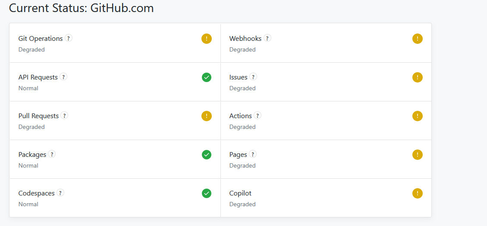

### Situation
Local environment (`hugo server`) worked perfectly, but deploying to GitHub Pages triggered a cascade of errors (HTTP 500 & Branch Protection issues).

### Task
Isolate whether the failure originated from my configuration files (`hugo.toml`, YAML scripts) or external service disruptions.

### Action
1. **Script Audit**: Verified GitHub Actions YAML syntax and environment permissions.
2. **Log Analysis**: Consulted Gemini to interpret the HTTP 500 stack trace.
3. **External Verification**: Checked the official **GitHub Status** dashboard after local configurations were confirmed correct.

### Result
The root cause was an upstream **GitHub Service Outage**. 
**Lesson Learned**: Before diving into a "code-fix" rabbit hole, check the service status first. 

> **Efficiency Logic**: 
>

>
> Let $P(\text{fail})$ be the probability of a bug. If $\text{Local} = \text{Pass}$ but $\text{Remote} = \text{Fail}$, then:
> $$P(\text{Server Outage}) > P(\text{Logic Error})$$
>
>

